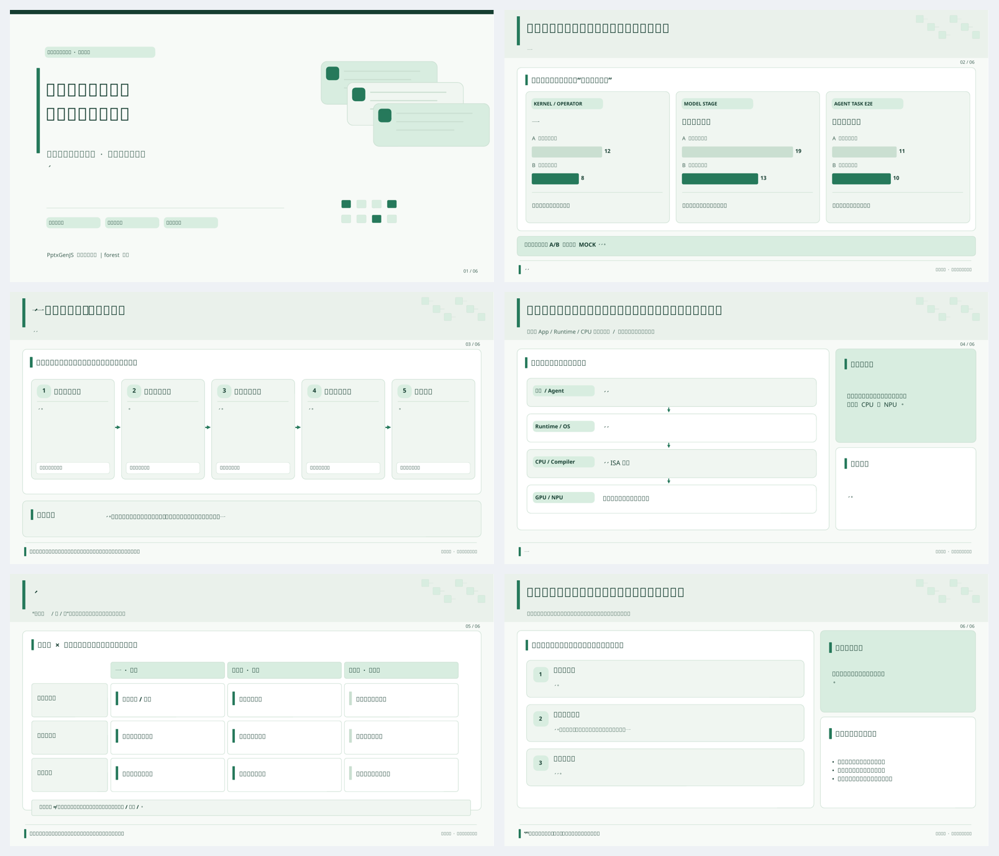
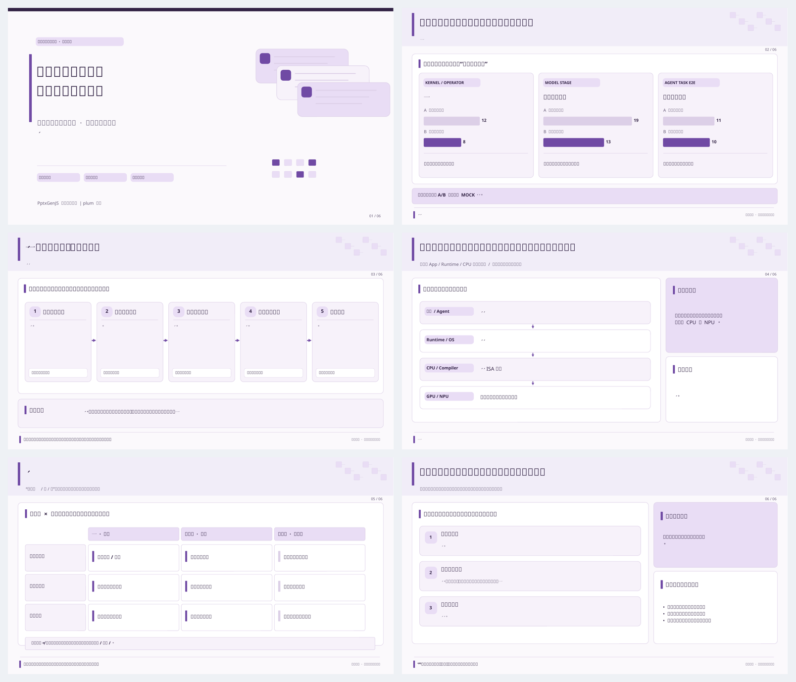
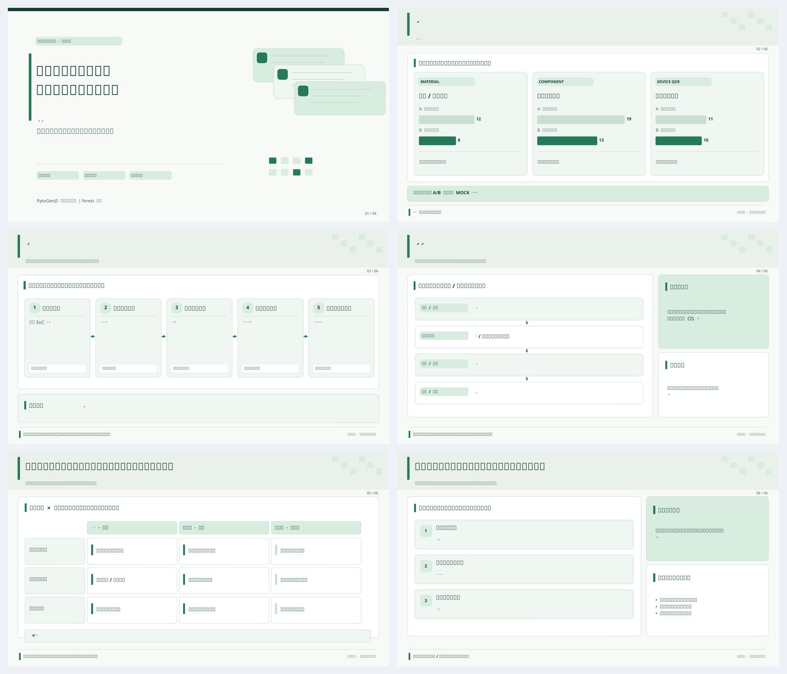
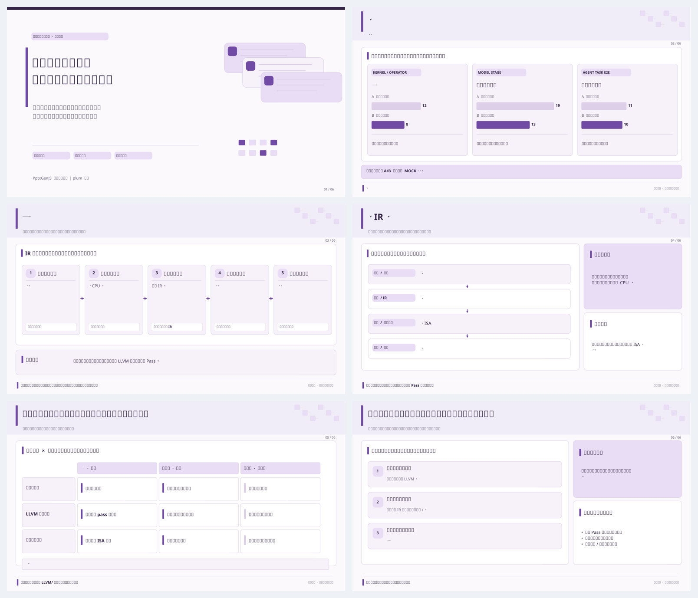

# Technical Insight Presentation — 可编辑样板与颜色/场景对比（v0.2.1）

此目录的 PPTX、PNG 与QA JSON均由 [PptxGenJS可执行脚本](../scripts/make_template_deck.js) + [渲染/验收脚本](../scripts/render_and_qa.py) 在 [GitHub Actions](../../../.github/workflows/build-technical-insight-visual-gallery.yml) 中实际构建并入库，**不是生成模型臆想的缩略图**。

**重要**：四套演示中的柱状数值均明确为 `MOCK/模拟`，不能用于任何论文结论。此处对照的是视觉系统可迁移、领域内容独立配置及主要PPT对象可编辑，不是新技术洞察研究的真实结果。

## 1. 同样的通用内容，不同色系（布局不漂移）

| 森林绿 | 紫色 |
|---|---|
|  |  |
| [下载可编辑PPTX](demo-forest-editable.pptx) · [结构 QA](demo-forest-QA.json) | [下载可编辑PPTX](demo-plum-editable.pptx) · [结构 QA](demo-plum-QA.json) |

## 2. 相同版式引擎，不同技术领域内容（不是只换颜色）

| 移动散热研究 / 绿色 | 编译器优化研究 / 紫色 |
|---|---|
|  |  |
| [下载可编辑PPTX](demo-thermal-forest-editable.pptx) · [结构 QA](demo-thermal-forest-QA.json) | [下载可编辑PPTX](demo-compiler-plum-editable.pptx) · [结构 QA](demo-compiler-plum-QA.json) |

领域迁移通过 [content-thermal.example.json](../templates/content-thermal.example.json) 和 [content-compiler.example.json](../templates/content-compiler.example.json) 实现，**覆盖标题、证据分层、技术机制、各层责任、路线与决策模块**。配色独立由主题 Token 决定。

## 3. 对真实报告的重要边界

此样板只是制作起点，不会替你自动推导新领域论文结论。正式汇报前必须：

1. 用真实原始论文/数据替换所有 MOCK 柱状值，并给出完整测量环境、基线、单位及链接；
2. 根据实际技术结构更换绘图 anatomy，不强迫任何研究问题适配五步或三列；
3. 每页制作并审阅详细内容合同，至少先审阅证据页、机制页与路线/决策页；
4. 逐页检查全高清 PNG 与备注，让最终页面达到真实受众可理解、技术人员能追问的要求；
5. 通过视觉与科研内容人工验收；Windows PowerPoint与现场投影检查仅在实际运行后才能标记完成。

[返回完整视觉系统Skill](../SKILL.md) · [视觉系统与构图规范](../references/visual-system.md) · [制作与发布记录](../VISUAL_PRODUCTION_V0_2_1_RELEASE.md)
